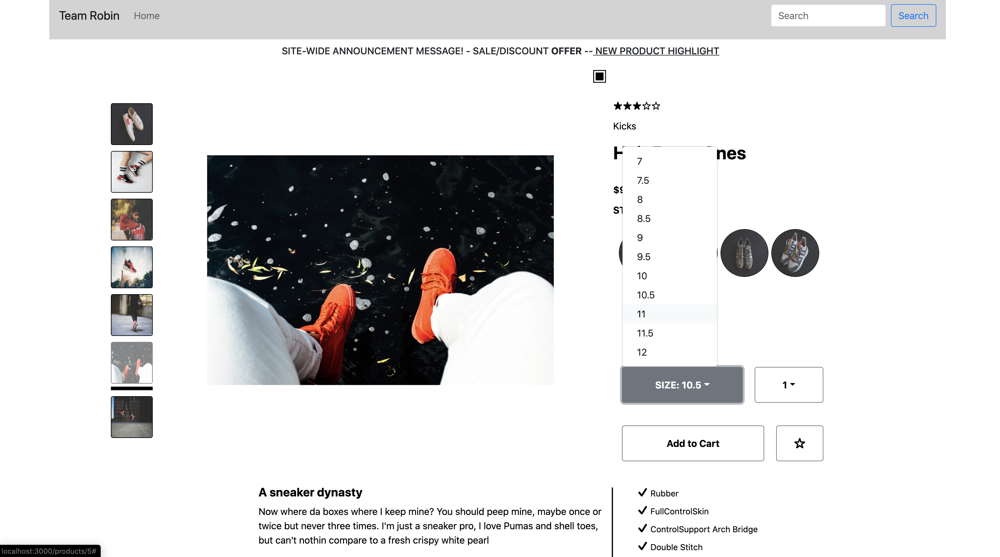
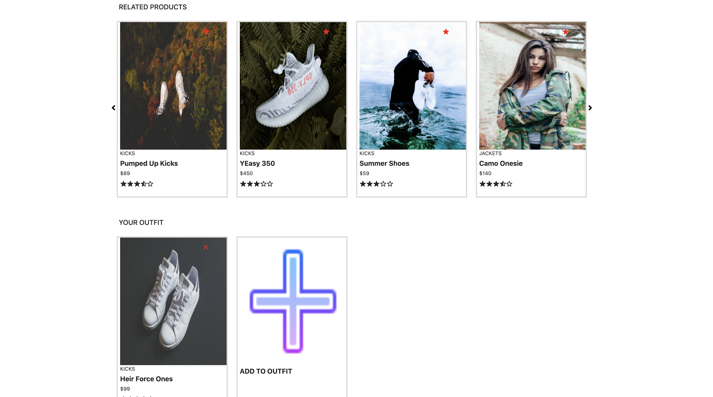
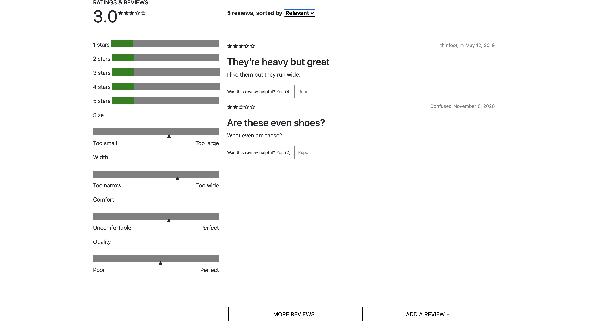

# Robin

Welcome to Robin! An e-commerce website powered by React and Redux. This single page store portal leverages popular libraries to provide a pleasant user experience while integrating with a legacy API service in the back-end.

## Product Details

_by Liam Murray_

This is the hero widget of the app, prominently displaying the current product visited by the client. It includes an image gallery to cycle through the various images for a given product, as well as images for each style available.

## Related Products

_by Deodat Ruplall_

In this section of the page, a dynamic carousel of cards displays basic information pertaining to products related to the currently visited product. By clicking on the cards the customer can switch to the selected product. An outfit wishlist below the related products stores the clients choices into a persistent caroussel by clicking the "Add To Outfit" button.

## Ratings and Reviews

_by J. Armando Garcia-Jacquier_

Ratings and Reviews can be found at the bottom of the page. All of the ratings and reviews linked to the current product are displayed in common UI pattern. The total avergage rating, a breakdown of star counts and characteristics satisfaction is displayed in the left column. The right column provides access to the individual reviews. More reviews can be displayed by clicking on a button at the bottom. The customer can also include a review for the current product through a pop up.

## Installation

Describe the installation process
To start application run (the last two commands need to simultaneously run while in development):

- npm install
  - This command will load all necessary packages/modules into your file system so you can properly run the code to serve up the page. The "node_modules" and "package-lock.json" should be created after this command is run
- npm run react-dev
  - This code will utilize webpack and compile your files and put all dependencies into a simple 'bundle.js' file so that it the only script tag you need in your HTML
- npm run start
  - Lastly, this code will run your Express server, which will actually serve up the HTML and React App if you try and load it in the browswer

## Usage

To use application navigate to localhost:3000/products/:productId
